  

<h1 align="center">Hi, I'm Dwi Jatmiko 👋</h1>

  <strong>Lecturer · Software Engineer · Cybersecurity · Penetration Tester</strong> 
  Jambi, Indonesia · Open to Work · Hybrid / Remote

  
  
  

  
  
  

---

I'm a lecturer at Universitas Nurdin Hamzah, a software engineer, and an information systems researcher. I build secure full-stack web applications, run cybersecurity assessments, and publish research indexed in **SINTA 2**. Some days it's the developer hat, some days the security hat — what matters is that the result is clean, usable, and responsible.

Currently finishing a **Master's in Information Systems (M.Kom)** at Universitas Dinamika Bangsa (GPA 3.89), focused on information security and decision support systems, after graduating with a **Bachelor's in Information Systems (S.Kom)** from Universitas Nurdin Hamzah. Day to day I'm mostly in PHP/Laravel, running assessments with security tooling, and shipping digital products end to end.

  
  
  
  

### 🛠️ What I do

- **Web & app development** — websites, web apps, and information systems built to a sensible security standard
- **Penetration testing** — application and IT infrastructure security testing, finding the gaps before someone else does
- **Security assessment** — vulnerability analysis, code security audits, and remediation recommendations
- **Side ventures** — building and running digital products end to end: [Warung Dwi](https://warungdwi.com) (digital store) and WujudKode (IT services / product studio)

---

### 🚀 Projects

| Project | Role | Summary | Link |
| --- | --- | --- | --- |
| **Warung Dwi** | Owner & Full-stack Developer | Premium digital store (Laravel 13 + PHP 8.5) — WhatsApp checkout, dual payment QRIS/USDT, dynamic catalog, admin CMS, bilingual ID/EN | [warungdwi.com](https://warungdwi.com) |
| **WujudKode** | Owner & Developer | IT services studio — helping businesses and professionals build digital products that make sense for both the team and the users | — |
| **Breachly** | Founder & Full-stack Developer | CTF & cybersecurity lab platform — 176 live labs, 490 challenges, 20+ categories across web, API, cloud, Active Directory, blue team & DFIR, on 9 isolated Docker servers | *coming soon* |
| **ToeflLab** | Owner & Full-stack Developer | Free online TOEFL practice — Structure, Reading, Listening, skill diagnostics, timed labs, score estimation, leaderboard | [toefllab.my.id](https://toefllab.my.id) |
| **Dwigital** | Co-founder & Developer | Game top-up, digital vouchers & PPOB — full product catalog, flash sales, transaction check, multi payment including QRIS | [dwigital.id](https://dwigital.id) |
| **PTA Jambi** | Security Assessor | Vulnerability assessment & remediation report for an institutional website (OWASP methodology) | — |
| **Hospital Information System** | Programmer | Enterprise hospital information system (confidential client) | — |

Some client work stays private for confidentiality reasons.

---

### 💻 Tech Stack

**Languages**

  
  
  
  
  
  
  
  
  

**Frameworks & Libraries**

  
  
  
  
  
  
  
  
  
  
  
  
  
  
  
  
  
  
  

**Database**

  
  
  
  
  

**Security & Penetration Testing**

  
  
  
  
  
  
  
  

**DevOps & Infrastructure**

  
  
  
  
  
  
  
  
  
  
  
  

**Testing & Quality / Integrations**

  
  
  
  
  
  
  
  
  

The full, always up to date **92-item stack** — grouped exactly as above — lives on my portfolio: **[dwijatmiko.my.id](https://dwijatmiko.my.id/#skills)**

---

### 📊 GitHub Stats

  
  

Generated by a scheduled GitHub Action (`.github/workflows/grs.yml`) instead of the public `github-readme-stats.vercel.app` demo, which is frequently rate-limited/paused.

---

### 💼 Experience

- **Lecturer** — Universitas Nurdin Hamzah, Jambi *(Sep 2026 – Present, part-time, hybrid)*
- **Information Technology Specialist** — Kementerian Haji dan Umrah Provinsi Jambi *(Aug 2026 – Present, seasonal, hybrid)*
- **Owner** — Warung Dwi *(2026 – Present, Jambi / Remote)*
- **Co-Founder** — Dwigital *(2025 – Present, Jambi)*
- **Programmer** — Rumah Sakit Baiturrahim, Jambi *(Jan – Jun 2025, on-site)*
- **Vulnerability Assessment** — PTA Jambi *(2025)*

### 🎓 Education & Research

- 🎓 **Master's in Information Systems (M.Kom)** — Universitas Dinamika Bangsa *(Oct 2024 – Nov 2026)*, GPA 3.89, focus on information security & decision support systems
- 🎓 **Bachelor's in Information Systems (S.Kom)** — Universitas Nurdin Hamzah *(2020 – 2024)*
- 🏅 Cambridge Assessment Scholarship — University of Cambridge *(2018)*
- 📄 Publication indexed **SINTA 2** — *"Laboratory Assistant Selection Using Fuzzy BWM and Fuzzy TOPSIS with Sensitivity Analysis and Monte Carlo Simulation"*, Jurnal Teknik Informatika (JUTIF), Vol. 7 No. 4, Aug 2026

### 📜 Certifications (11 total, highlights below)

- BNSP · LSP Teknologi Digital — **Junior Web Developer** Competency Certificate *(2025)*
- UNAMA Language Center — **TOEFL Certificate of Achievement**, score 600 *(2026)*
- Cambridge Assessment English — **ESOL International**, score 100 *(2018)*
- Universitas Dinamika Bangsa — **M.Kom**, Information Systems *(2026)*
- Universitas Nurdin Hamzah — **S.Kom**, Information Systems *(2024)*

Full list of 11 certifications: **[dwijatmiko.my.id/#certifications](https://dwijatmiko.my.id/#certifications)**

---

### 📍 A bit of context

- 📍 Based in **Jambi, Indonesia** · open to remote / freelance work
- 🏢 GitHub organization: [@ciptareka-id](https://github.com/ciptareka-id)
- ✉️ **dwijatmiko090@gmail.com** · 📱 [+62 822-7624-6922](https://wa.me/6282276246922)

For the full profile, services, and visual portfolio: **[dwijatmiko.my.id](https://dwijatmiko.my.id)**
Feel free to reach out to say hi, collaborate, or request a security assessment. 🤝
