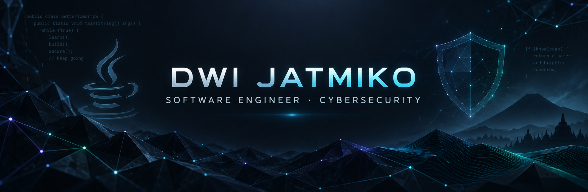

  

<h1 align="center">Halo, saya Dwi Jatmiko 👋</h1>

  <strong>Programmer · Cybersecurity · Penetration Tester</strong> 
  Jambi, Indonesia · open for freelance & kolaborasi

  
  
  

  
  
  

---

Saya membangun aplikasi web & mobile yang aman, melakukan penetration testing & security assessment, dan menulis riset ilmiah terindeks **SINTA 2**. Kadang pakai topi developer, kadang topi security — yang penting hasilnya rapi, bisa dipakai, dan bertanggung jawab.

Lulusan **Sistem Informasi (S.Kom)** dari Universitas Nurdin Hamzah, saat ini menempuh **Magister Sistem Informasi** di Universitas Dinamika Bangsa. Sehari-hari lebih sering di PHP/Laravel, assessment dengan tooling keamanan, dan menghidupkan produk digital sampai berjalan.

### 🛠️ Yang biasa saya kerjakan

- **Web & app development** — website, aplikasi web, dan sistem informasi dengan standar keamanan yang masuk akal
- **Penetration testing** — pengujian keamanan aplikasi & infrastruktur IT, cari celah sebelum orang lain yang nemuin
- **Security assessment** — analisis kerentanan, audit keamanan kode, dan rekomendasi perbaikan sistem
- **Side product** — membangun dan mengoperasikan toko/platform digital end-to-end

---

### 🚀 Proyek yang sedang / pernah saya pegang

| Proyek | Peran | Ringkas | Link |
| --- | --- | --- | --- |
| **Breachly** | Founder & Full-stack | Platform CTF & cybersecurity lab — 176 live labs, 490 challenges, 20+ kategori | *coming soon* |
| **Warung Dwi** | Owner & Full-stack | Toko digital premium — katalog, WhatsApp checkout, dual payment (QRIS/USDT), CMS | [warungdwi.com](https://warungdwi.com) |
| **Dwigital** | Co-founder & Developer | Top up game, voucher & PPOB | [dwigital.id](https://dwigital.id) |
| **ToeflLab** | Owner & Full-stack | Latihan TOEFL online gratis: Structure, Reading, Listening | [toefllab.my.id](https://toefllab.my.id) |
| **PTA Jambi** | Security Assessor | Vulnerability assessment & reporting website institusi (OWASP methodology) | — |
| **Hospital Information System** | Programmer | Sistem informasi rumah sakit enterprise (confidential client) | — |
| **Auto_Rotate** | Author | Utilitas Python kecil di repo publik | [yourboomax/Auto_Rotate](https://github.com/yourboomax/Auto_Rotate) |

Beberapa pekerjaan internal detailnya saya jaga privat — wajar kalau bersifat confidential.

---

### 💻 Tech Stack

**Languages**

  
  
  
  
  
  

**Frameworks & Libraries**

  
  
  
  
  
  
  
  

**Database**

  
  

**Security & Penetration Testing**

  
  
  
  
  
  
  
  

**DevOps & Infrastructure**

  
  
  
  
  
  
  

---

### 📊 GitHub Stats

  
  

---

### 🎓 Pendidikan & Riset

- 🎓 **Magister Sistem Informasi** — Universitas Dinamika Bangsa (2024–sekarang)
- 🎓 **S1 Sistem Informasi (S.Kom)** — Universitas Nurdin Hamzah (2020–2024)
- 📄 Publikasi **SINTA 2** — *"Laboratory Assistant Selection Using Fuzzy BWM and Fuzzy TOPSIS with Sensitivity Analysis and Monte Carlo Simulation"*, Jurnal Teknik Informatika (JUTIF), Vol. 7 No. 4, 2026

### 📍 Sedikit konteks

- 📍 Berbasis di **Jambi**, kerja remote / freelance welcome
- 🏢 Organisasi GitHub: [@ciptareka-id](https://github.com/ciptareka-id)
- ✉️ **dwijatmiko090@gmail.com** · 📱 [+62 822-7624-6922](https://wa.me/6282276246922)

Kalau mau lihat biodata lengkap, layanan, dan portofolio visual: **[dwijatmiko.my.id](https://dwijatmiko.my.id)**
Sopan sapa, collab, atau butuh assessment — silakan hubungi. 🤝
